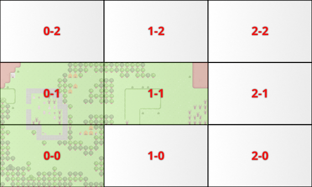
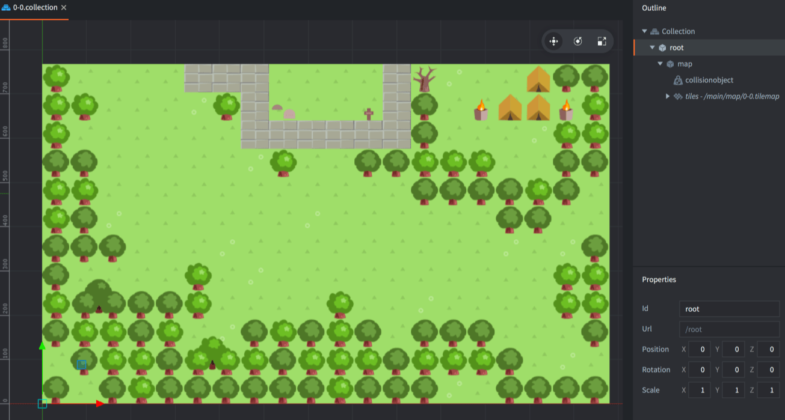
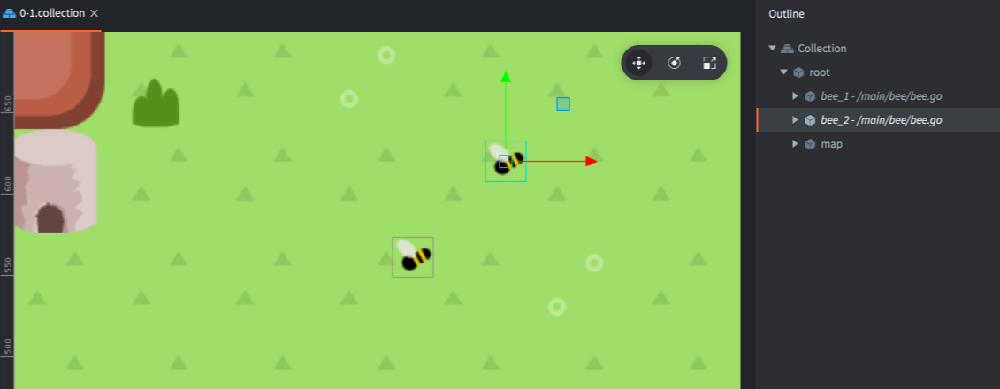
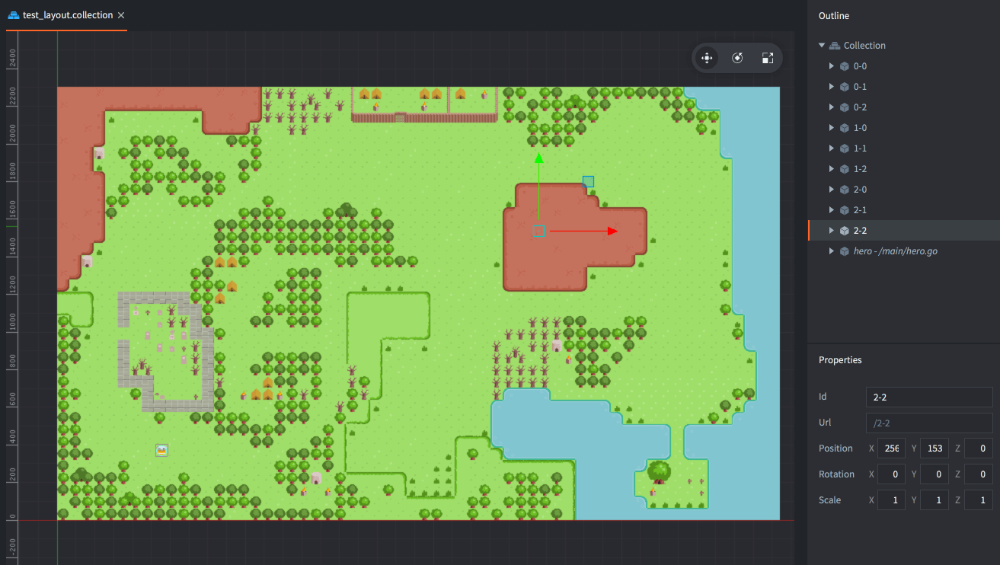
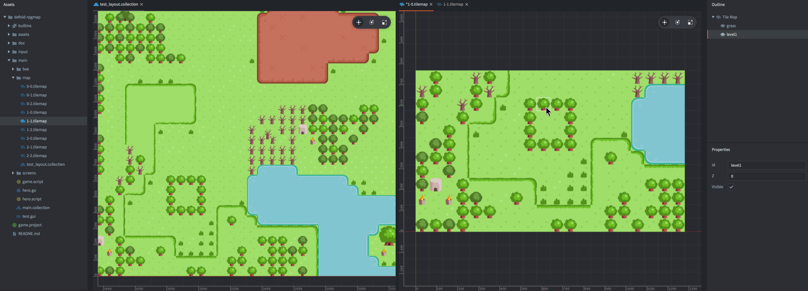
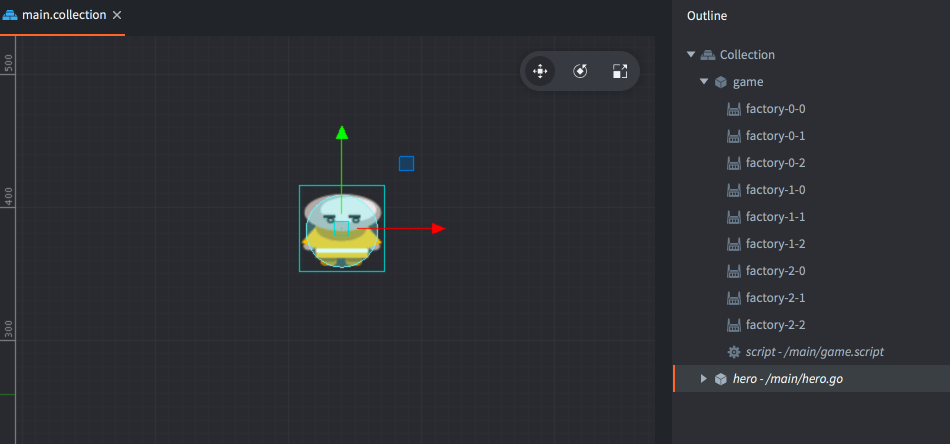
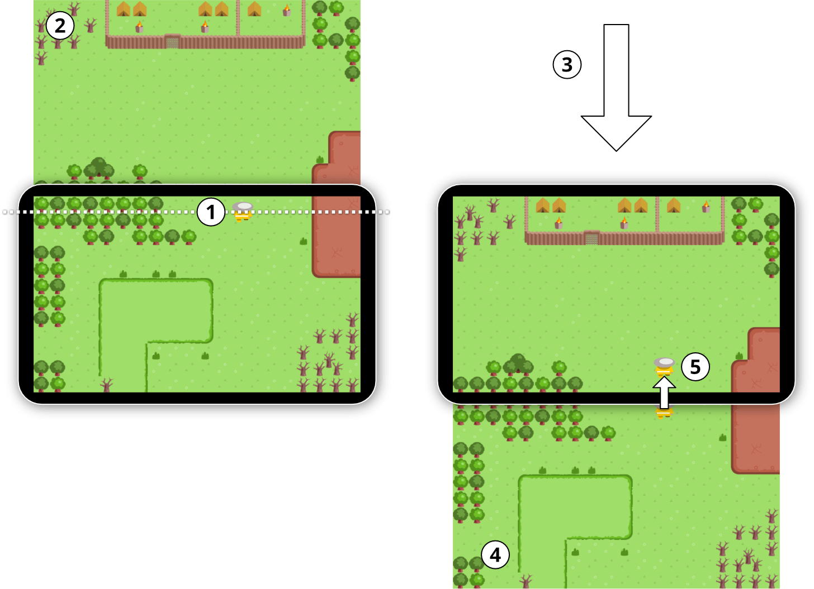

# RPG map sample

This sample shows one method of creating very large RPG maps in Defold. The design is based on the following assumptions:

1. The world is presented one screen at a time. This allows the game to naturally contain enemies and NPC characters within the boundaries of a single screen. The level designer has full control over how the world is presented on the player's screen.
2. The player character should be able to travel arbitrarily far without the game exhibiting floating point precision issues which may appear when objects are far from origo.
3. The player's movement is restricted by the map, so the level designer can stop the player from going somewhere with trees, rocks and whatnot.
4. It should be possible to mix and match tilemaps, sprites and other visual content.

First, [run the sample](defold://build) and walk through the 3x3 screen big world to get a feel for the sample. You control the character with the arrow keys.

## Screens

Each screen in the game world is built inside a separate collection containing the tilemap, collision object and other game objects that are unique to the screen. To facilitate management and loading of the screens the screen collections are named according to a simple scheme:

Each screen collection is named according to its position in the world grid. The first number is the X grid position and the second is the Y grid position.

In the *Assets* view, navigate to and open the collection ["/main/screens/0-0.collection"](defold://open?path=/main/screens/0-0.collection) which describes the screen in the lowest left corner of the map:

Notice that there is a game object named "root" that is the parent to all of the screen's content. This is another convention used in the sample. It serves two purposes:

1. When bringing a screen into view, only the "root" game object needs to be manipulated. All child objects are automatically moved along with the root parent.
2. If there are special game objects on a screen, they can be freely animated. Their movement is relative to the root parent so they will animate along with the screen when it is scrolled in or out. Special code is only needed if an object should move between screens.

The bees on screen 0-1 are simple showcases of this idea:

## Editing screens in the world context

Each screen has its own tilemap that is simple to edit in the built in tilemap editor. However, the drawback of editing each screen in isolation is that it is not possible to see how adjacent screens look, which is important to get continuity through the game world.

For that reason, a special collection was created. Its purpose is to be used as an editing tool during development. Since the collection is never used in the runtime static hierarchy, it is automatically excluded from all builds.

Open ["/main/map/test_layout.collection"](defold://open?path=/main/map/test_layout.collection) to view the world test layout collection:

Editing a specific screen with the test layout collection side by side gives you context for the screen you currently work on and the editing process is much nicer: edits to the screen tilemap (here on the right hand side) are immediately reflected in the test collection (here to the left):

## The main collection

Open ["/main/main.collection"](defold://open?path=/main/main.collection) to view the bootstrap collection for this sample.

The main collection contains the player character game object, controlled in 8 directions with the arrow buttons, and a second game object called "game" that controls the flow of the game. The "game" object consists of a script and one factory for each screen in the game. The factories are named according to the screen grid naming scheme.

The script ["/main/game.script"](defold://open?path=/main/game.script) tracks on which screen the player currently is. The script also reacts to a custom message called "load_screen". This message changes the current screen for a new in a given direction. Initially, the screen is loaded into the center of the screen and there is no other screen to switch place with.

## Changing screens

The hero is controlled by the script ["/main/hero.script"](defold://open?path=/main/hero.script). The script checks if the hero game object moves past a top, bottom, left or right line close to the screen edge:

1. If the hero moves close enough to a screen edge, a message is sent to the "game" object script to load the next screen.
2. The next screen collection is spawned through its collectionfactory component. The content of the collection is placed outside the screen.
3. The next screen is scrolled into the screen center and the current screen is scrolled out by the same distance and speed. The player character is also scrolled along by the same distance and speed.
4. The old current screen is deleted and the next screen becomes the new current screen.
5. The hero walks into view in the new screen and the player regains control.

All of this happens within a second so the transition is smooth and non disruptive.